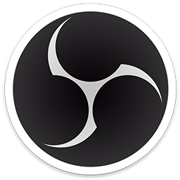
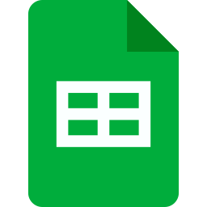

# Ferramentas

## Introdução

Para garantir uma melhor organização, comunicação e produção de artefatos ao longo do desenvolvimento do projeto, foi realizado um levantamento das principais ferramentas que serão utilizadas pela equipe. A Tabela 1 apresenta essas ferramentas, bem como suas respectivas finalidades e aplicações previstas durante a execução do projeto.

## Ferramentas Utilizadas

<b>Tabela 1</b> - Ferramentas Utilizadas no Projeto

|                                                                                                                           |        Ferramenta         |                               Finalidade                               |
| :-----------------------------------------------------------------------------------------------------------------------: | :-----------------------: | :--------------------------------------------------------------------: |
|                                    |          GitHub           | Organizar, versionar e documentar artefatos produzidos para o projeto.<a id="anchor_1" href="#FRM1">^1^</a> |
|                             |           Discord           |         Realizações de reuniões e gravações de apresentações.<a id="anchor_2" href="#FRM2">^2^</a>
|                             |           Teams           |         Realizações de reuniões e gravações de apresentações.<a id="anchor_2" href="#FRM2">^3^</a>
|                                    |          OBS           | Gravar e editar gravações.<a id="anchor_1" href="#FRM1">^4^</a> |          
|                                        |           Figma           |                    Produção de artefatos gráficos.<a id="anchor_3" href="#FRM3">^5^</a>                     |
|                                                                        |          MkDocs           |                  Criação das páginas de documentação.<a id="anchor_4" href="#FRM4">^6^</a>                  |
|                          |    Visual Studio Code     |                  Edição dos arquivos de documentação.<a id="anchor_5" href="#FRM5">^7^</a>                  |
|                                  |         WhatsApp          |             Utilizado como principal canal de comunicação.<a id="anchor_6" href="#FRM6">^8^</a>             |
|                                   |          YouTube          |                    Hospedagem de vídeos produzidos.<a id="anchor_7" href="#FRM7">^9^</a>                    |
|                           |     Google Planilhas      |      Criação de planilhas relacionadas ao cronograma e horários.<a id="anchor_8" href="#FRM8">^10^</a>       |
|                                  |        Google Docs        |                Criação e edição de tabelas e arquivos.<a id="anchor_9" href="#FRM9">^11^</a>
|  | ChatGPT |              Criação de imagens falsas para as personas.<a id="anchor_12" href="#FRM10">^12^</a>               |

## Referências Bibliograficas

><a id="FRM1" href="#anchor_1">1.</a> GitHub. Disponível em: https://docs.github.com/pt. Acesso em: 12 de abr. de 2025.
>
><a id="FRM2" href="#anchor_2">2.</a> Discord. Disponível em: https://discord.com/company. Acesso em: 12 de abr. de 2025.
>
><a id="FRM3" href="#anchor_3">3.</a> Microsoft Teams. Disponível em: https://www.microsoft.com/pt-br/microsoft-teams/group-chat-software. Acesso em: 12 de abr. de 2025.
>
><a id="FRM4" href="#anchor_4">4.</a> OBS Studio. Disponível em: https://obsproject.com/pt-br. Acesso em: 12 de abr. de 2025.
>
><a id="FRM5" href="#anchor_5">5.</a> Figma. Disponível em: https://www.figma.com. Acesso em: 12 de abr. de 2025.
>
><a id="FRM6" href="#anchor_6">6.</a> MkDocs. Disponível em: https://www.mkdocs.org. Acesso em: 12 de abr. de 2025.
>
><a id="FRM7" href="#anchor_7">7.</a> Visual Studio Code. Disponível em: https://code.visualstudio.com. Acesso em: 12 de abr. de 2025.
>
><a id="FRM8" href="#anchor_8">8.</a> WhatsApp. Disponível em: https://www.whatsapp.com/?lang=pt_br. Acesso em: 12 de abr. de 2025.
>
><a id="FRM9" href="#anchor_9">9.</a> YouTube. Disponível em: https://about.youtube. Acesso em: 12 de abr. de 2025.
>
><a id="FRM10" href="#anchor_10">10.</a> Google Planilhas. Disponível em: https://www.google.com/intl/pt-BR/sheets/about. Acesso em: 12 de abr. de 2025.
>
><a id="FRM11" href="#anchor_11">11.</a> Google Docs. Disponível em: https://www.google.com/intl/pt-BR/docs/about. Acesso em: 12 de abr. de 2025.
>
><a id="FRM12" href="#anchor_12">12.</a> ChatGPT. Disponível em: https://openai.com/index/chatgpt. Acesso em: 12 de abr. de 2025.
>

## Histórico de Versões

| Versão  |    Data    |                        Descrição                        |                                             Autor(es)                                             |                  Revisor(es)                   |
| :-----: | :--------: | :-----------------------------------------------------: | :-----------------------------------------------------------------------------------------------: | :--------------------------------------------: |
|  `1.0`  | 12/04/2025 |            Criação da página de ferramentas.            | [Victor Pontual Guedes Arruda Nóbrega](https://github.com/VictorPontual) | [Danielle Soares Da Silva](https://github.com/danielle-soaress) |
